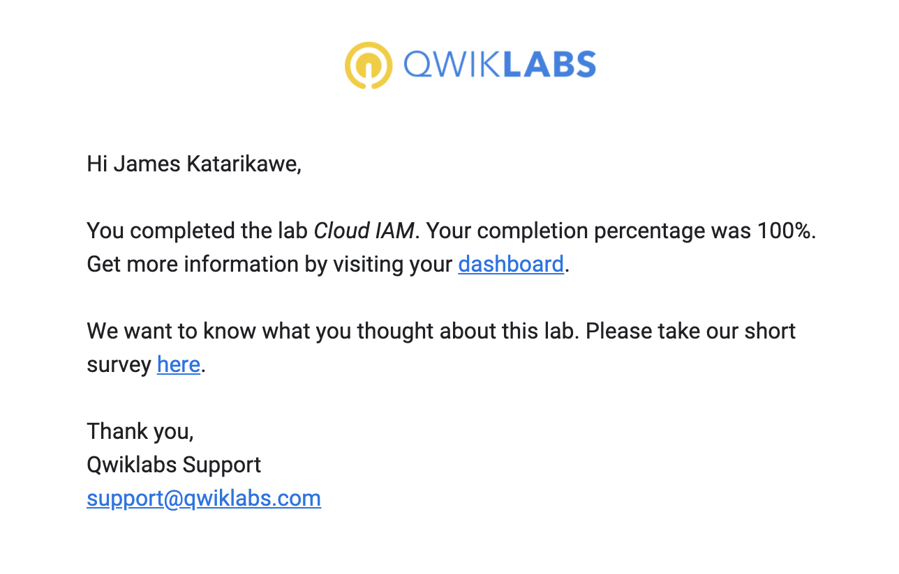
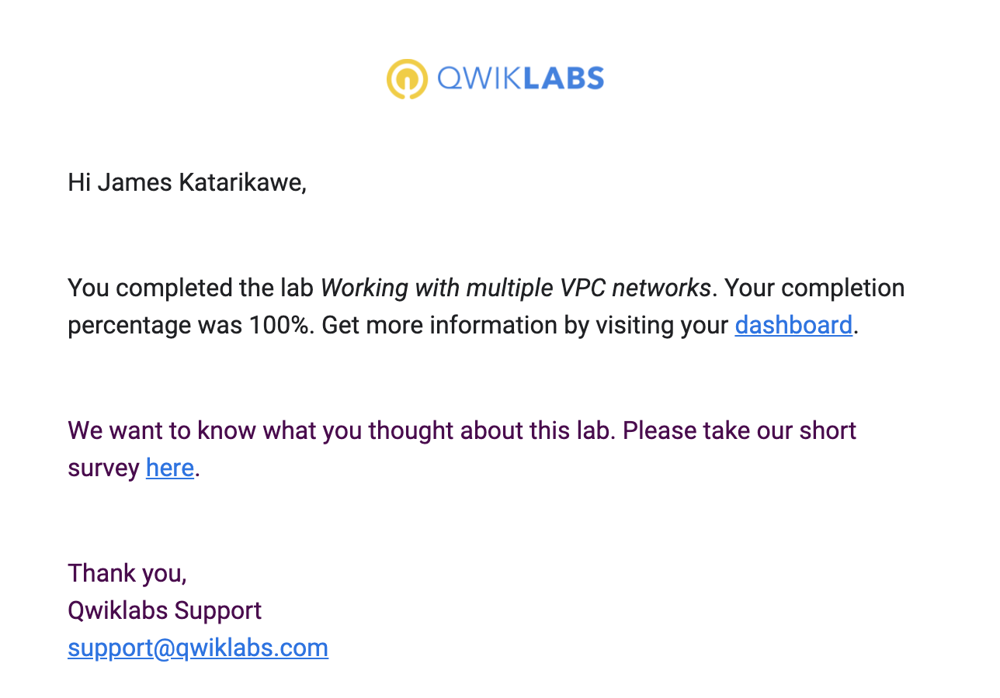
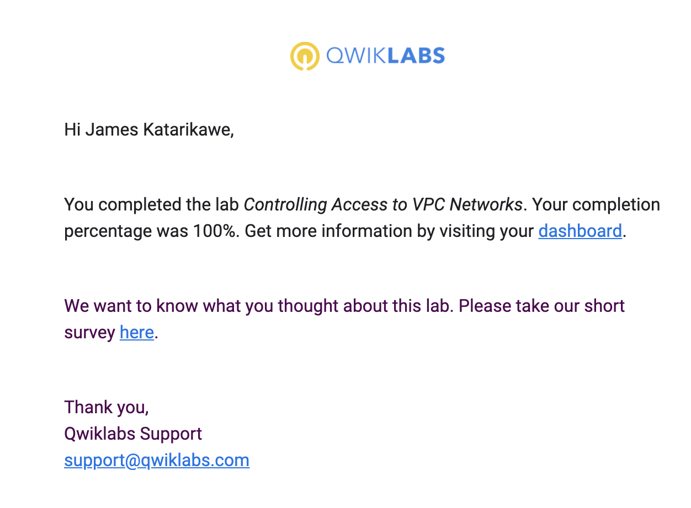
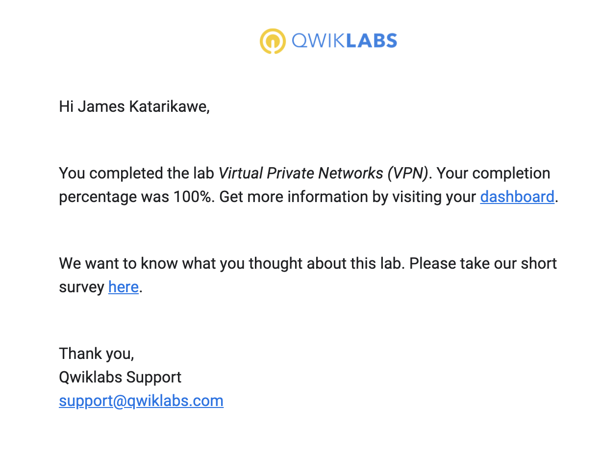
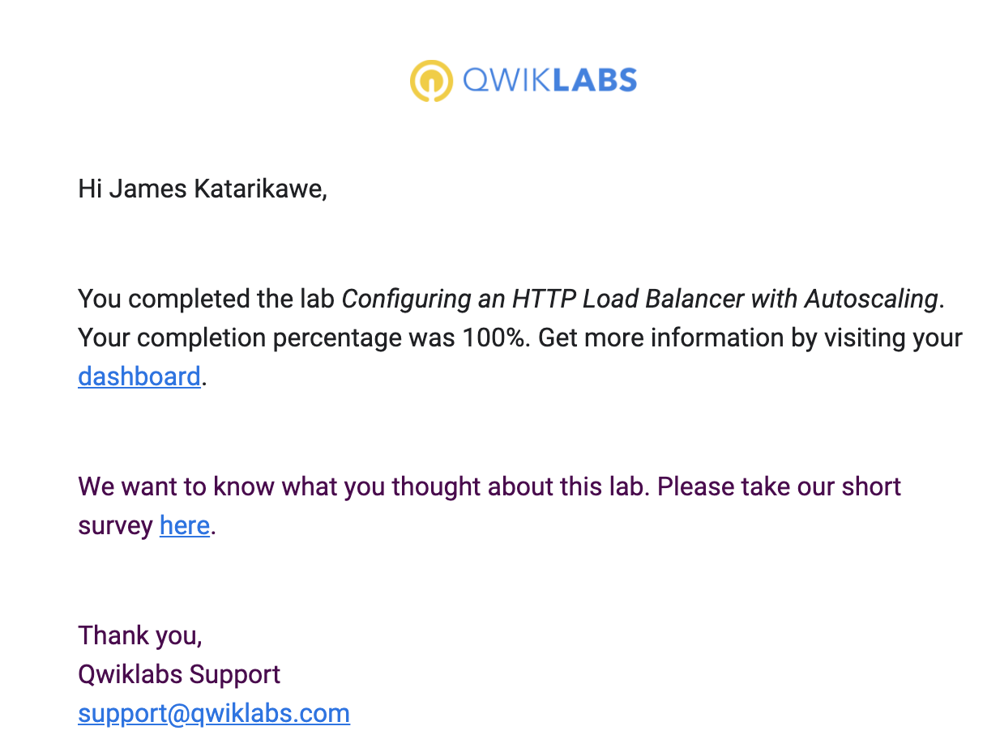
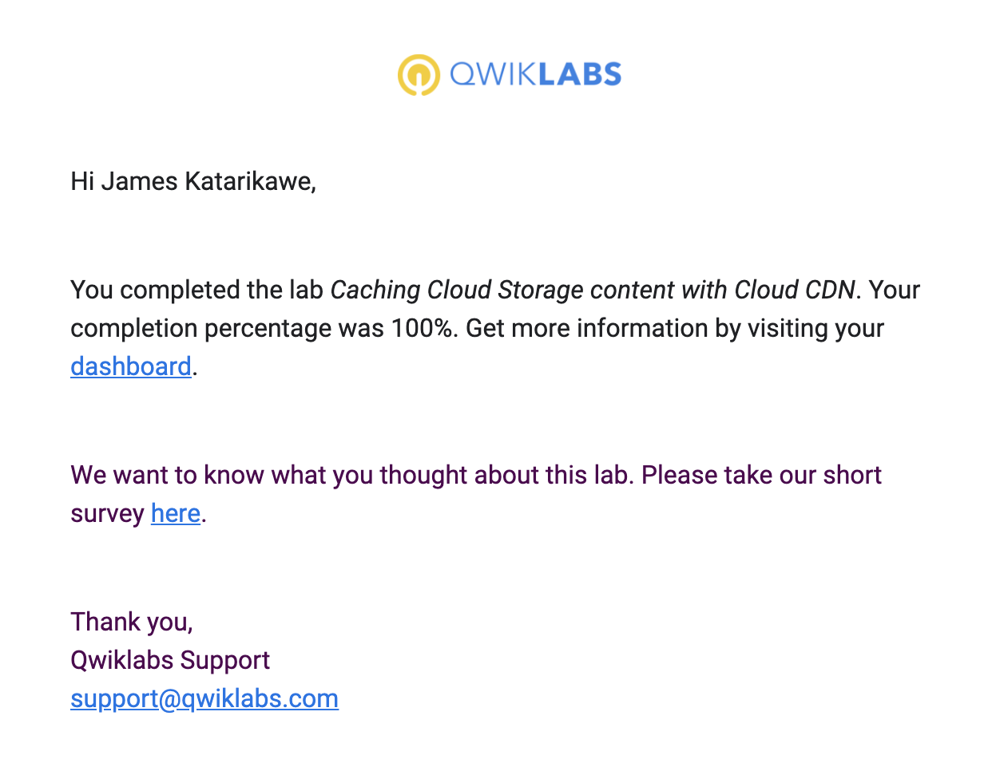
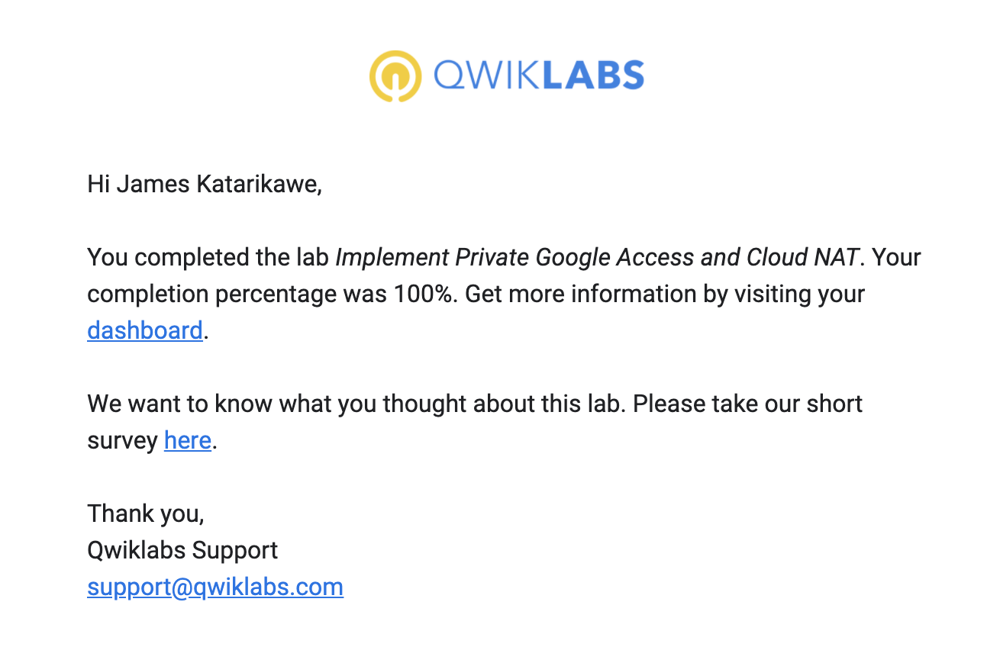
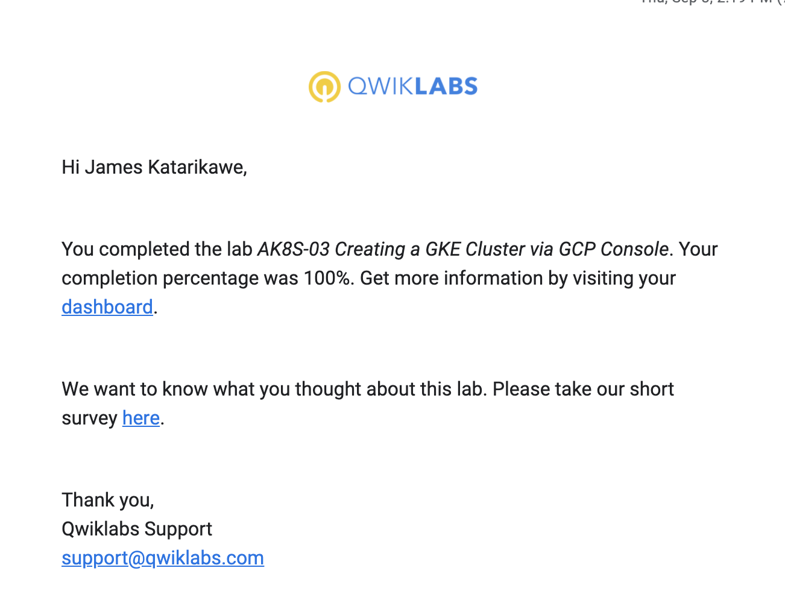
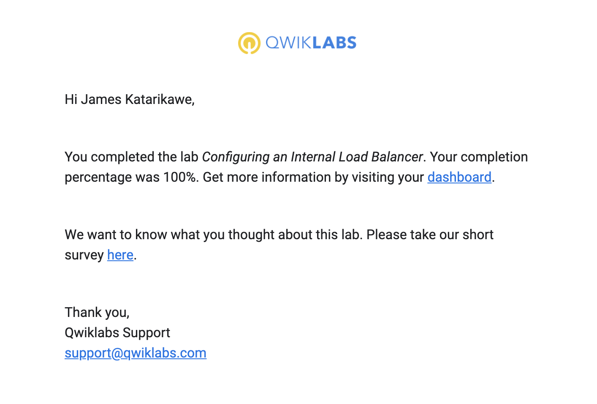

**Screenshots**

1. Cloud IAM

   

2. Working with multiple VPC networks

   

3. Controlling access to multiple VPC networks

   

4. Virtual Private Networks (VPN)

   

5. Configuring an HTTP Load Balancer with Autoscaling

   

6. Caching Storage Content with Cloud CDN

   

7. Implement Private Google Access and Cloud NAT

   

8. AK8S-03 Creating a GKE Cluster

   

9. Creating an Internal Load Balancer

10. AK8S-05 Upgrading Kubernetes Engine Clusters
11. AK8S-06 Creating Kubernetes Engine Deployments